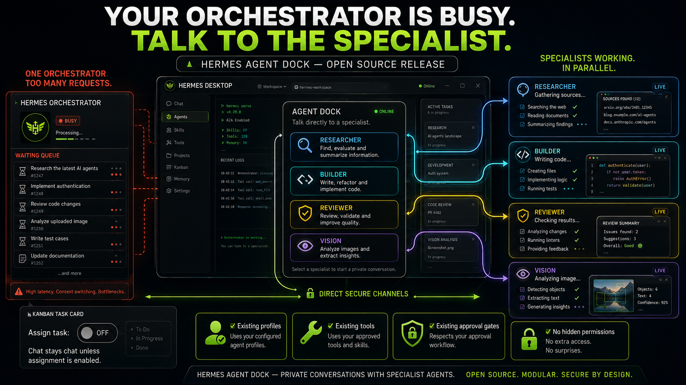
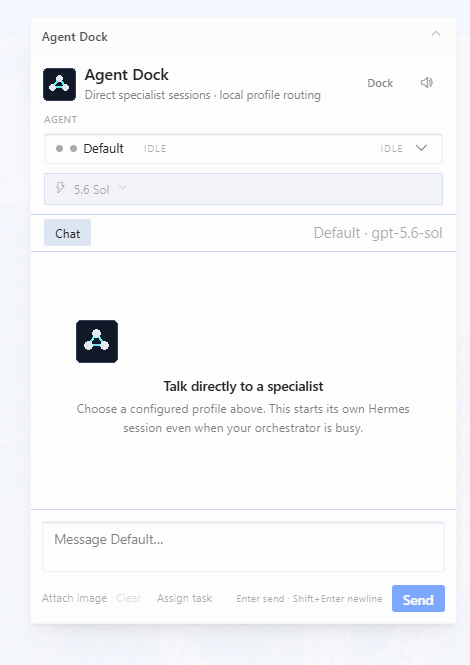
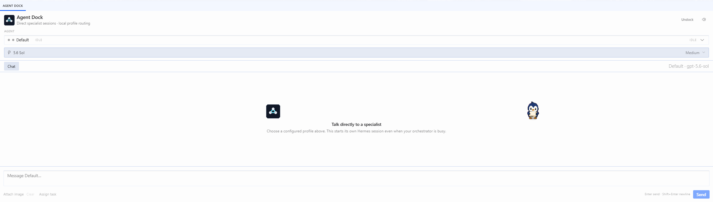

# Hermes Agent Dock

A native Hermes Desktop floating card by default for direct chat with configured specialist profiles—even when the active orchestrator is occupied. The visible **Dock**/**Undock** control switches between the public floating-pane and bottom-workspace contribution modes, and the selected mode persists in plugin-scoped storage. On Hermes builds that expose the public pet action area, a plain click on the in-window pet opens or closes the card; the persistent status-bar and command-palette launchers remain reliable fallbacks. Normal chat stays conversational; messages become lifecycle-tracked Kanban work only when **Assign task** is explicitly enabled.

> Community project. Not an official Nous Research release.

**Release candidate:** v0.5.0 · [Security policy](SECURITY.md) · [Third-party notices](THIRD_PARTY_NOTICES.md)

<p align="center">
  
</p>

<p align="center"><em>Conceptual artwork—not a product screenshot or benchmark. Its task IDs, counts, code, metrics, and live states are illustrative; sanitized real product views appear below.</em></p>

## Start here

Agent Dock is for people who already use more than one Hermes profile and want to reach any specialist without leaving the current Hermes Desktop workspace. It installs one local UI/backend pair, then discovers the profiles already registered by Hermes. It does not copy private agents between users or create new profiles automatically.

### Compatibility at a glance

- **Verified:** Windows 10 with Hermes Desktop, plus the v0.5.0 automated suite on hosted Windows, macOS, and Ubuntu runners.
- **Required:** Hermes Agent with Hermes Desktop, Python 3.10+, and at least one profile returned by `hermes profile list`.
- **Hermes v0.20.0:** open Agent Dock from the status bar or Command Palette. Pet-click activation requires a newer host that exposes `pet.actions`.
- **Not claimed as directly verified in this release:** Hermes Desktop UI behavior on macOS or Linux. Installation and the full automated suite run on hosted macOS, Windows, and Ubuntu, but native Desktop release QA is still separate.

### Five-minute setup

1. Confirm Hermes can see at least one local profile:

   ```bash
   hermes profile list
   ```

2. Install the exact v0.5.0 release after it is tagged:

   ```bash
   git clone --branch v0.5.0 --depth 1 https://github.com/BkashJEE/hermes-agent-dock.git
   cd hermes-agent-dock
   python install.py
   ```

3. Confirm the inventory contains `enabled user 0.5.0 hermes-agent-dock`:

   ```bash
   hermes plugins list --plain --no-bundled
   ```

4. Fully restart Hermes Desktop once so its Python backend mounts.
5. Open Agent Dock from the **Agent Dock** status-bar control or Command Palette → **Agent Dock: Toggle specialist pane**.
6. Pick an existing profile. Leave **Assign task** off for ordinary chat; turn it on only when you intentionally want a Kanban card.

On Windows, the installer uses `%LOCALAPPDATA%\hermes` by default. `HERMES_HOME` or `python install.py --home <path>` overrides that location. Never point `--home` at another user's profile or a directory you have not backed up.

### Your first conversation

> Sending a message starts a real Hermes session through the selected profile's configured provider and may consume model tokens.

1. Open Agent Dock and select a configured profile.
2. Wait for that profile's provider-scoped model list to load, then confirm the model and reasoning effort.
3. Type a message and press **Enter** or **Send**.
4. Wait for the final response. Launcher mode polls background jobs and does not display token-by-token streaming.
5. Use **New conversation** when you want a fresh session for that profile.

The selected profile keeps its existing tools, memory, model/provider configuration, approval gates, session, and active job. Different profiles can run concurrently; one profile still runs one job at a time.

## Real product views

### Floating mode

<p align="center">
  
</p>

<p align="center"><em>Sanitized real product view. Chat is empty and the local profile avatar was replaced with a neutral agent glyph.</em></p>

### Docked mode

<p align="center">
  
</p>

<p align="center"><em>Sanitized real product view. Docked mode reserves workspace space and exposes an Undock action.</em></p>

## What it does

- Adds a compact Hermes-themed contribution as a floating card by default (`placement: 'floating'`, `anchor: 'top-right'`, `380px × 540px`) and reuses the official BrandMark already bundled with the host app.
- The card's **Dock**/**Undock** control switches only between supported public `PANES_AREA` contributions: floating mode stays above the workspace; docked mode uses the native bottom workspace tile and divider, reflowing Browser and the main workspace while Files remains independent.
- Discovers actual Hermes profiles; it does not invent agents or pretend one profile is every specialist.
- Adds a profile-scoped **Capability Center** for the selected Hermes profile: effective provider/model, configured/not-configured provider credential state, installed skills, enabled toolsets, MCP server names, approval gates, and the execution target. Credential values, MCP commands, mounts, paths, and forwarded environment values are never returned.
- Lets an operator explicitly choose **Host** or **Docker** for new sessions. Docker is disabled until its executable is available; a Host-to-Docker change also fails closed when dormant mounts, environment forwarding, extra arguments, or persistence settings require review in Hermes. Changing the target requires confirmation and never migrates an already-running session.
- Uses a compact agent picker and a model selector populated from the selected profile's configured/authenticated Hermes provider. It exposes that provider's available alternatives—not an unrelated global provider catalog—and labels each model with a deterministic **Workload tier**.
- Starts or resumes a profile-scoped Hermes session without routing through the focused orchestrator.
- Discovers real live sessions for the Desktop's current runtime profile through `session.active_list` and lets the operator explicitly attach the Dock to one stable session/run binding without restarting it.
- Persists attached run identity, ASK/NUDGE/confirmed REDIRECT/STOP requests, dispatch leases, privacy-reduced events, and receipts in a profile-local SQLite WAL ledger under `$HERMES_HOME/agent-dock/control-plane.sqlite3`.
- Routes NUDGE through Hermes `session.steer`, REDIRECT through `session.redirect`, idle ASK through `prompt.submit`, and confirmed Stop through `session.interrupt`; the Dock never injects directly into a tool call.
- Keeps acceptance distinct from application: a gateway-accepted request is not shown as applied without a later consumer-originated application receipt. Verification status comes from Hermes's read-only `verification.status` ledger.
- Preserves a separate session ID and compact local message history per profile. Every new bubble stores and displays the viewer's local date, time to the second, and timezone; legacy messages without stored time are labeled `Date unavailable`.
- Keeps one independent active job and draft per profile, so another agent can be opened and messaged immediately while earlier agents continue in the background. Hermes Desktop notifies when each job finishes or fails.
- Uses one deterministic profile-ID-derived avatar in the selector, assistant messages, and working state; the unchanged raw profile ID remains the routing authority.
- Replaces generic loading spinners with an adapted 20 px **solving** state from Jakub Antalik's MIT-licensed Thinking Orbs: one cyan hue with contrast-adjusted dark/light variants, visible only while real profile jobs are active, static under reduced-motion preferences, and paused offscreen or in hidden tabs.
- Accepts up to four local PNG, JPEG, GIF, WebP, or BMP images (10 MB each, 25 MB total) and passes them through Hermes's native `chat(..., images=...)` path. Image bytes are job-scoped and removed after completion, failure, or cancellation.
- Displays each selected agent's final reply or a bounded actionable failure inside the Dock transcript.
- Creates a real card on the `executive-organization` Hermes Kanban board only when **Assign task** is active; ordinary chat never creates a card.
- Keeps the linked card synchronized with the Dock job and settles captured responses as `blocked / needs_input` for Dad/CEO verification rather than falsely declaring the task complete.
- Optionally plays a deduplicated achievement unlock chime; first load establishes a silent baseline and a persistent mute control is available.
- Shows a compact **Subagents (N)** tree only after Hermes emits an authoritative
  start event for the exact parent job. Child rows expose bounded lifecycle
  state, a safe current-tool label, model/API calls, and reported input/output
  token totals when Hermes supplies them.
- Reconciles profile-local durable job reservations after restart without
  relaunching uncertain work, and requires explicit exact-runtime reattachment.
- Uses compact attachment chips and assistant-only Copy; history retains neither
  image bytes nor private source paths. A bounded **Retry** endpoint re-runs a
  terminal job under its stable identity; a **Ledger** endpoint lists durable
  jobs; and **Assign-after** links a finished job to the Kanban board without
  re-running it.

## Job management API

The backend exposes a small, local, same-origin API for managing durable jobs
after the fact. All endpoints are privacy-reduced: the durable ledger stores
metadata only and never persists prompt, response, or image bytes.

| Method & path | Purpose | Returns |
| --- | --- | --- |
| `GET /jobs?limit=N` | List durable jobs, newest first, bounded (default 50, max 200) | `{ jobs: [...], count: N }` |
| `POST /jobs/{id}/assign` | Link a terminal job to the `executive-organization` Kanban board without re-running it | `201` + public job |
| `POST /jobs/{id}/retry` | Re-run a terminal job under its stable identity with a fresh attempt | `202` + public job |

**Assign-after** requires a `message` (the task text for the card; the ledger
stores no prompt). It is idempotent: the idempotency key is the stable job ID,
so a repeat returns the existing card instead of creating a duplicate. Active
jobs are rejected with `409`; an unavailable Kanban board is `503`.

**Retry** requires a `message` and re-validates model/provider/session against
the profile catalog. The job ID, profile, and `request_id` are preserved — a
retry is the same logical job run again, not a new job. It respects the
four-active-session cap (`429` when full) and only accepts terminal jobs
(`409` while active).

## Important boundaries

- A dock message launches a **real Hermes agent session** and can consume model tokens.
- The selected profile keeps its normal tools, policies, and approval gates. Agent Dock never adds `--yolo` or `--accept-hooks`.
- Live attachment is allowed only when the selected profile exactly matches the active Desktop runtime profile. A matching display name alone is never treated as a cross-profile or cross-channel identity proof.
- Control messages enforce `inherit-only` permission scope. The Dock can preserve or reduce authority but cannot add tools, credentials, filesystem scope, or approval power.
- **ASK** is read-only and only dispatches when the run is idle. **NUDGE** preserves the objective and is delivered by Hermes at its next tool-result boundary. **REDIRECT** changes plan/objective and requires an explicit second confirmation.
- Hermes currently exposes no verified per-run Pause/Resume contract. The Dock labels Pause unavailable instead of presenting a cosmetic control.
- Launcher mode polls a background job and displays the final response; token-by-token streaming is not yet exposed by the public cross-profile Desktop plugin API.
- Transient status-read failures keep the active job visible and continue reconciliation every ten seconds; only an explicit terminal response or structured not-found result clears the reservation.
- Lost POST responses are reconciled with the stable `request_id`; an accepted backend job remains visible instead of being orphaned or duplicated.
- Recent dock messages are best-effort renderer-local data in Hermes namespaced plugin storage—not a backup system.
- Pending image bytes remain only in renderer memory until submission. History stores attachment names/metadata, never base64 payloads, and the backend deletes each job's temporary image directory in `finally`.
- Explicit assignment requires the local `executive-organization` Kanban board and a valid `request_id`. The card records the accountable profile, stable Dock job identity, and idempotency key. Request retries reuse the existing job/card during the bounded retention window; terminal jobs are retained for up to one hour, subject to a 200-job cap, while active jobs are never evicted.
- Achievement integration is optional. It reads the local `hermes-achievements/scan_snapshot.json` and intentionally omits evidence, session IDs, and session titles.
- Subagent prompts, goals, summaries, reasoning, tool arguments/results,
  commands, credentials, private paths, stderr, and transcripts never enter the
  public child projection. Missing token usage is **Unavailable**, not zero.
- The subprocess runner does not possess Hermes's exact in-process gateway
  transport authority for a live child. Child rows therefore show **Direct chat
  unavailable**; Agent Dock never routes a child message through the parent or
  spawns a replacement child while pretending it is the original.

## Requirements

- Hermes Agent with Hermes Desktop.
- At least one configured Hermes profile (`hermes profile list`).
- Python 3.10+ available as `python`.
- Optional: the Hermes achievements backend for achievement cards.

## Install

```bash
git clone https://github.com/BkashJEE/hermes-agent-dock.git
cd hermes-agent-dock
python install.py
```

Fully restart Hermes Desktop after the first install and whenever backend Python files change so the Desktop process mounts the installed backend. Frontend-only `plugin.js` changes can hot-reload.

The installer:

1. Backs up an existing Agent Dock installation under `$HERMES_HOME/backups/hermes-agent-dock/`.
2. Copies `plugin.js` to `$HERMES_HOME/desktop-plugins/hermes-agent-dock/`.
3. Copies the local API to `$HERMES_HOME/plugins/hermes-agent-dock/`.
4. Enables only `hermes-agent-dock` through the Hermes CLI.
5. Writes a local install manifest with SHA-256 hashes.

No npm, pip, post-install hook, admin elevation, or package lifecycle script is used.

### Install through your Hermes agent

Instead of rebuilding or adapting Agent Dock, give your Hermes agent the verified release and ask it to install the exact published files:

> Install Hermes Agent Dock v0.5.0 from https://github.com/BkashJEE/hermes-agent-dock for my current Hermes home. Do not recreate, rewrite, or expand the project. Inspect the release README, SECURITY.md, LICENSE, THIRD_PARTY_NOTICES.md, and `proof/control-plane-verification.json`; confirm the repository, `v0.5.0` tag, and version metadata; run the documented tests; run `python install.py`; verify `hermes plugins list --plain --no-bundled` reports `hermes-agent-dock` enabled at v0.5.0; compare the runtime files with the hashes in the local install manifest; and report the exact result plus whether Hermes Desktop must restart. Do not read or copy conversation content, memories, credentials, or unrelated files, and do not modify any existing profile, model, provider, tool, approval policy, or execution target without a separate explicit confirmation.

This is an install-and-verify workflow, not a code-generation prompt. The published installer keeps a timestamped rollback backup and restores the previous desktop and backend components if replacement fails.

### Existing-agent discovery and privacy

Agent Dock does not crawl the user's Hermes workspace. Its backend calls Hermes's official profile and configuration APIs. The Capability Center launches a short-lived process scoped to the selected profile and enumerates only skill markers under that profile's `skills` directory plus allowlisted configuration metadata. It does not enumerate conversation bodies, prompts, memories, credential values, MCP commands/arguments, mounts, forwarded environment values, or arbitrary profile files.

The picker shows the profiles already configured on that Hermes installation. Selecting one starts or resumes a session under that profile's isolated Hermes home, so the profile keeps its existing tools, policies, memory, model configuration, and approval gates. Agent Dock does not create, merge, or silently reconfigure agents.

### Custom/isolated Hermes home

```bash
python install.py --home /path/to/hermes-home
```

For a copy-only smoke test that does not change `plugins.enabled`:

```bash
python install.py --home /path/to/temp-home --copy-only
```

## Use

1. Open Hermes Desktop.
2. Plain-click the in-window Hermes pet to open or close the floating card on hosts that support `pet.actions`. Drag and Shift-click retain Hermes's native pet behavior. The persistent **Agent Dock** status-bar control and **Agent Dock: Toggle specialist pane** command remain fallbacks on every supported host.
3. Use **Dock** in the card header to switch to the native bottom workspace tile, or **Undock** to return to the floating card. This mode is persisted in plugin-scoped storage and is restored the next time the Dock opens.
4. Pick an agent from the dropdown. The model selector starts on that profile's saved model and offers the alternatives Hermes reports for the same configured provider/auth setup.
5. If that profile owns live Desktop sessions, choose the exact session and select **Attach live**. The Dock then shows the observed status, durable run history, latest receipt, and verification status.
6. Choose **ASK**, **NUDGE**, or **REDIRECT**. REDIRECT requires confirmation. **Stop** also requires confirmation and warns that Hermes clears queued prompts and denies pending approvals for that session.
7. Otherwise, optionally use **Attach image** for up to four supported local images, then send a message or an image-only analysis request. `Enter` sends; `Shift+Enter` inserts a newline.
8. Leave **Assign task** off for normal conversation. Enable it before sending only when the message must create and track a real Kanban card.
9. Use **New conversation** to stop resuming that profile's previous Dock session.
10. Use the speaker icon to mute or enable unlock sounds.

By default the Dock is a floating card and does not change workspace geometry. In docked mode, Browser and the main workspace reflow around the bottom tile, which is resized with Hermes's native horizontal divider; Files remains independent.

## Troubleshooting

- **No profiles appear:** run `hermes profile list`. Agent Dock only displays profiles Hermes already knows; it does not invent or silently configure agents.
- **Agent Dock does not appear:** run `hermes plugins list --plain --no-bundled` and confirm the exact `hermes-agent-dock` row is enabled. Then use Command Palette → **Reload desktop plugins** or restart Hermes Desktop.
- **The card appears but requests fail:** fully restart Hermes Desktop. `plugin.js` can hot-reload, but the Python backend mounts only when the Desktop backend starts.
- **Models do not load:** verify the selected profile's provider authentication and saved model in Hermes. Agent Dock never supplies, reads, or migrates credentials.
- **Pet click does nothing:** this is expected on normal Hermes v0.20.0. Use the status-bar or Command Palette fallback.
- **Installation or reversible uninstall fails midway:** the lifecycle scripts attempt to restore both previous components and preserve a timestamped backup under `$HERMES_HOME/backups/hermes-agent-dock/`. Read the reported blocker before retrying; do not delete the backup first.

When opening a public issue, include the operating system, Hermes version, Agent Dock version, exact reproduction steps, and sanitized error text. Do not attach conversations, profile files, credentials, tokens, or the contents of private Hermes homes. Report suspected vulnerabilities through [SECURITY.md](SECURITY.md), not a public issue.

## Uninstall

Reversible (default):

```bash
python uninstall.py
```

This reads Hermes's compact plain inventory and verifies that the exact Name column for `hermes-agent-dock` reports `not enabled` (or the legacy `disabled` label), then moves the plugin-specific install directories to a timestamped backup. A missing, malformed, or similarly named row is not accepted as proof. If disablement cannot be confirmed, installed code is left untouched. To delete the installed code instead after verified disablement:

```bash
python uninstall.py --purge
```

Restart Hermes Desktop once if the Python backend had already been mounted.

## Architecture

```text
Hermes Desktop plugin.js
  ├─ public PANES_AREA floating/docked contributions + pet/status/palette toggles
  ├─ persistent `dock-mode` in ctx.storage; floating default, bottom workspace on demand
  ├─ ctx.storage: profile sessions, compact histories/attachment metadata, drafts, active jobs, mute + unlock baseline
  ├─ renderer-memory-only image selection and compact previews
  ├─ host.request: session.active_list / steer / redirect / interrupt / verification.status
  └─ ctx.rest('/...')
       ↓ same-origin, plugin-scoped API
Hermes plugin_api.py
  ├─ hermes_cli.profiles.list_profiles()
  ├─ strict booleans, profile/saved-model/image validation + request idempotency
  ├─ signature-checked job-scoped image files with unconditional cleanup
  ├─ exact JSON request over stdin to dock_runner.py (`shell=False`)
  ├─ profile-keyed jobs + cancellation checks before and after process spawn
  ├─ one-hour/200-terminal-job retention
  ├─ opt-in `executive-organization` Kanban creation/lifecycle sync
  ├─ durable `/control/*` run, queue, lease, receipt, observation, and event API
  └─ bounded sanitized response/error projection
control_store.py
  └─ profile-local SQLite WAL ledger with canonical bindings and immutable receipt lifecycle
dock_runner.py
  └─ invokes profile-scoped Hermes `chat(..., images=...)` and emits one bounded JSON result
```

The backend launches a fixed runner path with `shell=False` and sends the request as exact JSON over `stdin=subprocess.PIPE`. Profile names come from Hermes's registry, provider/model pairs must match the profile's saved setup, session IDs are format-validated, message/response/image sizes are bounded, and the API accepts at most four concurrent direct jobs.

## Verify from source

```bash
node --input-type=module --check < plugin.js
node --test tests/test_dock_state.mjs
python -m unittest discover -s tests -v
python -m py_compile backend/dashboard/plugin_api.py backend/dashboard/control_store.py backend/dashboard/dock_runner.py install.py uninstall.py
```

## Project files

- `plugin.js` — build-free Hermes Desktop ESM runtime.
- `backend/plugin.yaml` — standalone Hermes backend descriptor.
- `backend/dashboard/plugin_api.py` — profile/model discovery, capability routes, jobs, cancellation, diagnostics, and opt-in Kanban integration.
- `backend/dashboard/capability_center.py` — isolated safe capability projection and confirmed Host/Docker target updates.
- `backend/dashboard/control_store.py` — durable run identity, control queue, leases, receipts, history, status, and privacy-reduced event ledger.
- `backend/dashboard/dock_runner.py` — JSON-stdin profile runner and bounded result serializer.
- `install.py` / `uninstall.py` — reversible, stdlib-only lifecycle.
- `PRODUCT_SPEC.md` — acceptance contract and explicit non-goals.
- `SECURITY.md` — trust boundaries and reporting guidance.
- `CONTRIBUTING.md` — bug reports, feature suggestions, pull-request workflow, verification, and privacy requirements.
- `docs/assets/` — privacy-sanitized real product views and the clearly labeled onboarding illustration.
- `LICENSE` — Agent Dock's MIT license grant.
- `THIRD_PARTY_NOTICES.md` — attribution and license text for the adapted Thinking Orbs painter.

## Contributing and suggestions

Contributions are welcome. You can:

- [Report a bug](https://github.com/BkashJEE/hermes-agent-dock/issues/new?template=bug_report.yml) with reproducible, privacy-safe evidence.
- [Suggest a feature](https://github.com/BkashJEE/hermes-agent-dock/issues/new?template=feature_request.yml) by describing the unmet need and desired outcome.
- Fork the repository and open a pull request using the built-in PR template.

Read [CONTRIBUTING.md](CONTRIBUTING.md) before submitting. It defines the focused-change workflow, required verification, compatibility expectations, and strict privacy/security boundaries. Report vulnerabilities privately through [SECURITY.md](SECURITY.md), not a public issue.

## Roadmap

- Public SDK support for cross-profile streamed gateway events instead of final-response polling.
- Permission-request handoff inside the dock when Hermes exposes a safe plugin contract for it.
- Public SDK support for durable backend job persistence across a full Desktop process restart.
- Authorized cross-channel profile continuity: channel-specific transcripts with shared durable profile context and task state, plus explicit exact-session handoff between Telegram, Agent Dock, and future surfaces.

## Known limitations in v0.5.0

- Responses appear after bounded background polling; token-by-token streaming is not available.
- Hermes-native floating panes can move, collapse, and remember their host-owned position, but Agent Dock does not claim arbitrary freeform resizing.
- Active backend jobs do not survive a complete Hermes Desktop process restart.
- Attached control runs, queued interventions, receipts, and privacy-reduced events do survive restart; dispatch still requires a live Desktop gateway session with the exact runtime ID.
- Hermes does not yet emit a correlation event proving that a particular steer/redirect changed a later plan. The Dock therefore stops at **Accepted by Hermes** unless an explicit application receipt is recorded.
- Per-run Pause/Resume is unavailable in the current Hermes gateway and remains disabled.
- Available models are limited to the selected profile's configured and authenticated provider.
- Pet-click activation depends on host support for `pet.actions`; the status-bar and command-palette launchers remain the reliable fallbacks.
- Telegram and Agent Dock currently keep separate live session transcripts. Selecting the same profile shares that profile's configuration, tools, policies, and durable memory, but does not automatically merge or resume the latest cross-channel conversation.

## License

[MIT](LICENSE) © 2026 BkashJEE
